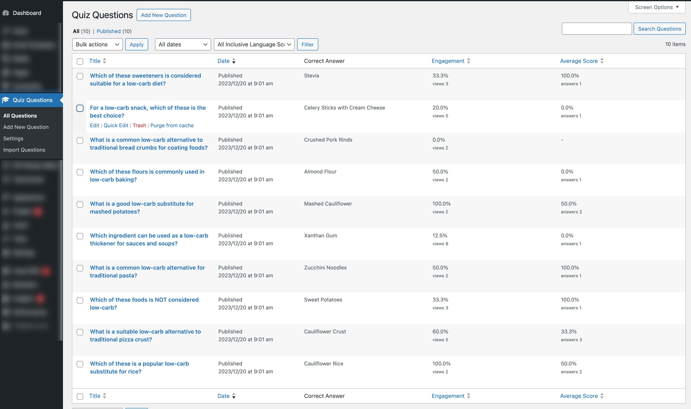
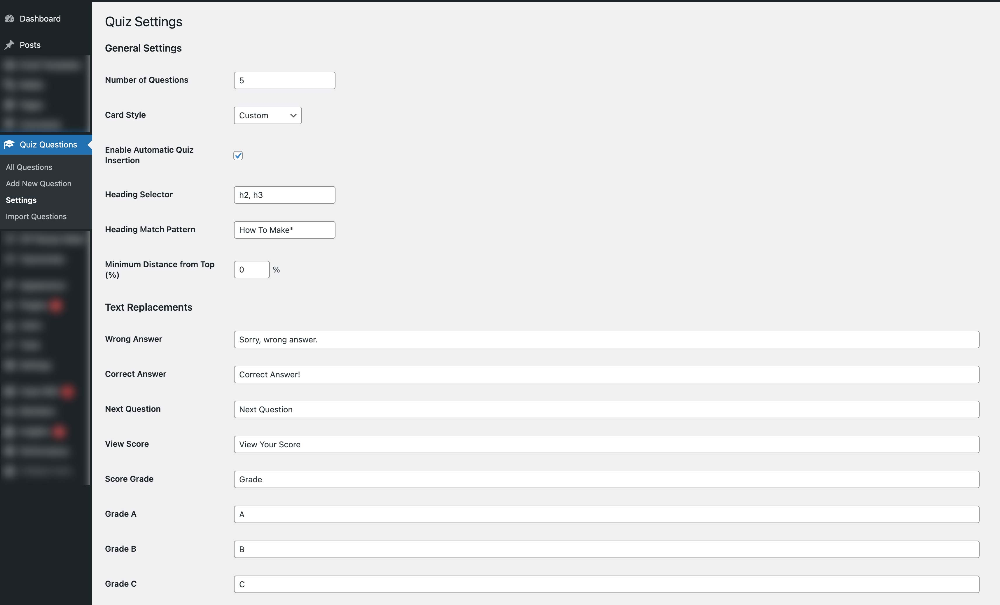
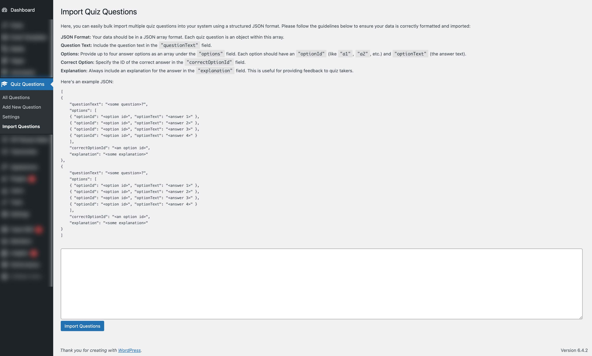

# KDQuiz - Interactive Web Quiz Plugin for WordPress

## Introduction
KDQuiz is a simple WordPress plugin designed to enhance user engagement through interactive quizzes. It allows users to craft their own questions and precisely control the display of quizzes on their website, ensuring a non-intrusive yet engaging experience for visitors.

## Demo

You can find a demo of the plug in this [winter salad recipe](https://ketodiet.com/winter-salad-with-roast-pumpkin-feta-and-cranberries/#kd-quiz-container) where the user is presented with questions relevant to low carb cooking which is that the website is about. This is key to using this plug in, the questions you create have to be relevant to your content to maximise engagement.

## Features
- **Customizable Quizzes**: Create your own questions and tailor the quiz to match your website's content and style.
- **Flexible Display Options**: Unlike pop-up quizzes, KDQuiz provides a seamless integration with your website's content. 
- **Shortcode Insertion**: Easily integrate quizzes into your web pages using a simple shortcode for precise positioning.
- **Auto-Insertion Rules**: For pages without a shortcode, optionally auto-insert quizzes based on criteria such as heading selector, heading text wildcard, and minimum distance from the top (measured in web view height %).

## Goal
The primary goal of KDQuiz is to increase user interaction and engagement on your website, encouraging visitors to spend more time exploring your content.

## Installation and Usage
1. **Installation**: Download the plugin and install it on your WordPress site.
2. **Creating Quizzes**: Access the quiz creation interface from the WordPress dashboard > Quiz Questions.
3. **Shortcode Usage**: Insert `[kd-quiz]` shortcode anywhere in your post or page to display the quiz. *Please note that currenty a page or post can only have one quiz*.
4. **Setting Auto-Insertion Rules**: Configure rules for automatic quiz insertion in pages without the shortcode. This is an optional step, if you prefer precise positioning control use the shortcode above.

##Quick Guide

### Adding / Managing Questions and Viewing Interaction Stats

- **Adding Questions**: To add a new quiz question, navigate to 'Quiz Questions' and click 'Add New Question'. Fill in the question and answer fields as prompted.
- **Managing Questions**: You can view and manage all questions under the 'All Questions' section. Here you can edit, delete, or view the details of each question.
- **Interaction Stats**: Each question displays interaction statistics, showing the engagement percentage and average score, which helps you understand how users are interacting with the questions.



### Settings - Styling and Auto-Insertion Configuration

- **Styling**: In 'Settings', you can customize the appearance of your quiz by selecting a 'Card Style' from the dropdown menu or creating a custom style.
- **Auto-Insertion**: Enable automatic quiz insertion into posts/pages by checking the 'Enable Automatic Quiz Insertion' box. Configure which headings (h2, h3, etc.) trigger quiz insertion with 'Heading Selector' and 'Heading Match Pattern'.
- **Feedback Customization**: Customize the feedback messages for wrong and correct answers, as well as the text for 'Next Question' and 'View Score' buttons.



### Import - Batch Importing Quiz Questions

- **Batch Import**: The 'Import Questions' section allows for a bulk import of quiz questions. Prepare your questions in a JSON format, adhering to the structure shown in the example.
- **JSON Format**: Ensure each question object includes "questionText", an array of "options" with "optionId" and "optionText", the "correctOptionId", and an "explanation" for feedback.
- **Importing**: Once your JSON file is prepared, use the 'Import Questions' button to upload your file and add multiple questions to your quiz at once.




## Directory Structure
- `assets/`: Contains static resources like CSS, JavaScript, and images.
- `includes/`: PHP include files and other components.
- `kd-quiz.php`: The main PHP script for the plugin.

## Contribution
Contributions to KDQuiz are welcome! Feel free to fork the repository, make your changes, and submit pull requests.

## Styling
The plugin comes with four predefined styles: vibrant, light, dark, and custom. When the custom style is selected, the container class for the quiz has the class `kd_quiz_style_custom`. This allows for extensive customization using CSS to style virtually every aspect of the quiz card.


### HTML And CSS Classes 

#### Questions & Answers

The HTML structure for the quiz questions and answers is outlined below. To customize specific elements within the quiz, use the selector `.kd_quiz_style_custom .<nested class>`. This approach offers flexibility in styling, allowing for unique visual presentations of the quiz elements. However, it's recommended to avoid styling the `kd-card-inner` class directly, as it's integral to the card flip animation, and modifying it may impact the quiz's interactive functionality.

```html
<div id="kd-quiz-container">
  <div class="kd-quiz-card kd_quiz_style_custom">
    <div class="kd-card-inner">
      <div class="kd-card-face kd-card-front">
        <p class="kd-question">Your question?</p>
        <ul class="kd-options">
          <li class="kd-option">Answer 1</li>
          <li class="kd-option">Answer 2</li>
          <li class="kd-option">Answer 3</li>
          <li class="kd-option">Answer 4</li>
        </ul>
      </div>
	   <div class="kd-card-face kd-card-back">
	     <p class="kd-incorrect">
               <span class="kd-answer-icon"></span>Sorry, wrong answer.
             </p>
	     <p class="kd-answer">Some explation.</p>
	     <button class="kd-action">Next Question</button>
	   </div>
    </div>
  </div>
</div>
```
#### Score Card
The score card is displayed after the quiz is completed, showcasing the user's performance. It's placed inside the `.kd-card-front` element, replacing the last question. The score card is wrapped in a `div` with a grade-specific class, which can be `kd-final-a`, `kd-final-b`, `kd-final-c`, or `kd-final-f`, reflecting the user's grade. These classes can be styled to highlight different performance levels visually. For example, `kd-final-a` could be styled with a bright, positive color to denote excellent performance, while `kd-final-f` might use a more subdued palette.

```html
<div id="kd-quiz-container">
  <div class="kd-quiz-card kd_quiz_style_custom">
    <div class="kd-card-inner">
      <div class="kd-card-face kd-card-front">
        <div class="kd-final-f">
          <p class="kd-final-grade">Grade <span>F</span></p>
          <p class="kd-final-score">Your Score 0%</p>
          <p class="kd-final-message">Looks like you need a bit more practice. Don't give up!</p>
        </div>
      </div>
    </div>
  </div>
</div>
```

## License
This software is free for both personal and commercial use. However, in accordance with the license, any modifications or enhancements made to this software must be shared and submitted to the repository. Please review the LICENSE file for more details.

## Support
For support, feature requests, or bug reports, please open an issue on the GitHub repository.
